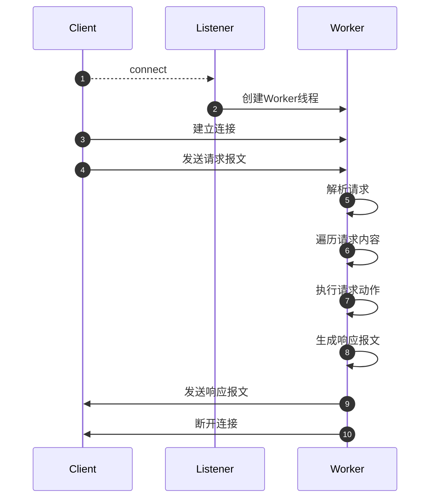
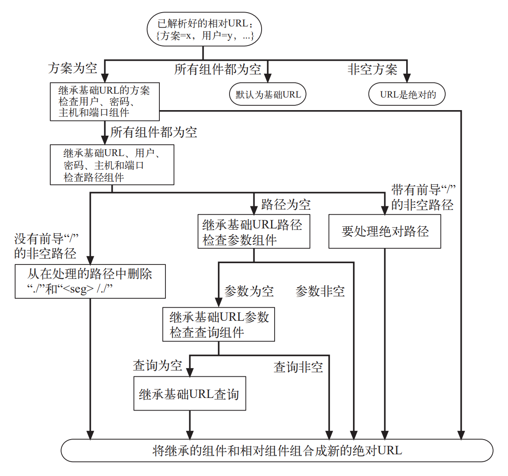
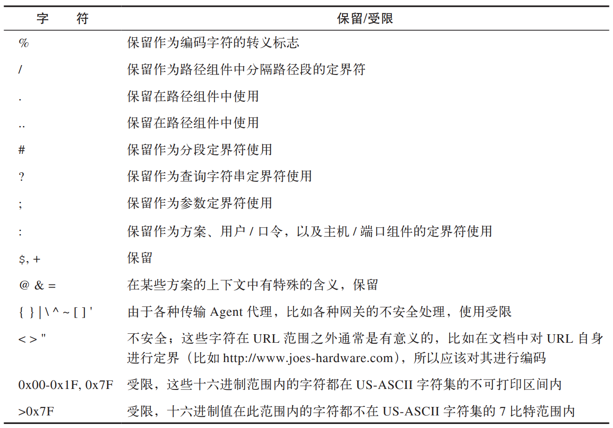

# SiHttp 项目设计文档

## 需求分析

- 实现HTTP/1.0, HTTP/1.1 协议，加深对HTTP协议的理解
- 管理服务器资源，积累Linux系统编程经验
- 基于TCP协议实现HTTP协议，提高对TCP/IP协议的认识程度

## 实现目标

- 服务端应能管理服务器本地的资源

## Server 处理逻辑 V1

- 主要流程
  1. Listener线程监听端口
  2. 建立连接并为其创建Worker线程
  3. Worker线程读取请求
  4. Worker线程解析请求，涉及正则表达式匹配、atoi等内容，将请求头解析成json
  5. Worker线程遍历json，访问资源
  6. Worker线程创建响应报文
  7. Worker线程写回HTTP响应报文并断开连接（V1不处理长连接）



- 类图

  ```mermaid
  classDiagram
  class Listener{
  	+std::vector<Worker> workerList
  	
  	-Listener()
  	+getInstance() Listener
  	+init() void
  	+listen() void
  }
  ```

  ```mermaid
  classDiagram
  class Worker {
  	-std::unique_ptr<RequestParser> parser;
  	-std::unique_ptr<ResponseGenerator> generator;	
  	+Worker()
  	+run() int
  }
  
  ```

  ```mermaid
  classDiagram
  class RequestParser {
  	+parse(std::vector<char>)
  }
  ```

  ```mermaid
  classDiagram
  class ResponseGenerator{
  	
  }
  ```

  ```mermaid
  classDiagram
  class Router
  ```

  ```mermaid
  classDiagram
  class FSManager
  ```

  ```mermaid
  classDiagram
  class Logger
  ```


### 第三方库

- [tplgy/cppcodec MIT Licensed](https://github.com/tplgy/cppcodec)
- [nlohmann/json: JSON for Modern C++ MIT Licensed](https://github.com/nlohmann/json)

## HTTP协议细节说明

- 更详细的内容见 [HTTP | MDN (mozilla.org)](https://developer.mozilla.org/en-US/docs/Web/HTTP) 

### 报文

#### 请求报文

```http
GET /test/hi-there.txt HTTP/1.0
Accept: text/*
Accept-Language: en, fr

```

```http
<method> <request-URL> <version>
<headers>

<entity-body>
```

#### 响应报文

```http
HTTP/1.0 200 OK
Content-type: text/plain
Content-length: 19

Hi! I'm a message!
```

```http
<version> <status> <reason-phrase>
<headers>

<entity-body>
```

- `<request-URL>` 命名请求资源，或URL路径组件的完整URL（还有一些场景，待补充）
- `version` `HTTP/<major>.<minor>`
- `<reason-phrase>` 只对人类有意义
- 回车换行符应支持 `\r\n`, `\n` 两种格式
- 将起始行与首部的连续制表符、连续空格均转为1个空格，换行符前不留空格、制表符
  - 请求行、响应行的字段由空格符分割
- 首部冒号前后可能会有空格，应当有识别键值对能力
- 多值首部字段，注意识别值与值之间的分隔符
- 首部延续行，将长首部分为多行以提高可读性，每行前面至少有一个空格或制表符
- 响应报文的 `Content-length` 应由HTTP库自动添加
- 起始行的URL也可能会有参数传递，如 `https://www.google.com.hk/search?q=hello+world&oq=hello+world&sourceid=chrome&ie=UTF-8`


#### URL

##### 参数

`http://hello.world/get-this;sale=false/index.html;graphics=true`

- 其中有两个路径段 hammers 和 index.html ??
- 分别有参数sale=false, graphics=true

##### 查询字符串

`http://hello.world/inventory-check.cgi?item=1234&color=blue`

- `?` 查询字符串开头，多个键值对用 `&` 分割

##### 片段

`http://hello.world/tools.html#drills`

- `#` 片段开头，服务端忽略该值，直接返回整个文档

##### URL快捷方式（客户端视角）

- 若url不是绝对地址，则需使用 Base URL

- Base URL

  - HTML中包含`<BASE>` 标签，指明Base URL
  - 根据其所属资源的URL作为基础，如`http://hello.world/tools.html`+`./hammers.html` = `http://hello.world/hammers.html`

- 解析相对URL

  

##### URL字符集

- `%`后跟两个表示字符的ASCII码的十六进制数，如：`%7E`表示`~`，`%20`表示空格，`%25`表示`%`

- 保留及受限的字符集

  


#### 方法

##### GET

- 请求服务器的某个资源

- ```http
  GET /seasonal/index-fall.html HTTP/1.1
  Host: hello.world
  Accept: *
  
  ```

- ```http
  HTTP/1.1 200 OK
  Content-Type: text/html
  Context-Length: 617
  
  <HTML>
  <HEAD><TITLE>......
  ......
  ```

##### HEAD

- 与GET行为类似，但只返回首部，不返回主体部分
- 确保HEAD返回首部与GET完全相同


##### PUT

- 语义是让服务器用请求的主体部分来创建一个由所请求的URL命名的新文档，如果存在，就用这个主体来替代

- ```http
  PUT /product-list.txt HTTP/1.1
  Host: hello.world
  Content-type: text/plain
  Content-length: 432
  
  <HTML>
  ......
  ```

- ```http
  HTTP/1.1 201 Created
  Location: http://hello.world/product-list.txt
  Content-type: text/plain
  Content-length: 35
  
  http://hello.world/product-list.txt
  ```

- PUT 方法一般要求先进行用户认证

##### POST

- 通常用来支持HTML的表单

- ```http
  POST /inventory-check.cgi HTTP/1.1
  Host: hello.world
  Centent-type: text/plain
  Content-length: 18
  
  item=bandsaw 2647
  ```

- ```http
  HTTP/1.1 200 OK
  Content-type: text/plain
  Context-length: 35
  
  The bandsaw model 2674 is in stock!
  ```

##### TRACE

- 最后一站的服务器（不一定是目标服务器）会弹回一条TRACE响应

- ```http
  TRACE /product-list.txt HTTP/1.1
  Accept: *
  Host: www.joes-hardware.com
  ```

- ```http
  TRACE /product-list.txt HTTP/1.1
  Host: www.joes-hardware.com
  Accept: *
  Via: 1.1 proxy3.company.com
  ```

- ```http
  HTTP/1.1 200 OK
  Content-type: text/plain
  Content-length: 96
  
  TRACE /product-list.txt HTTP/1.1
  Host: www.joes-hardware.com
  Accept: *
  Via: 1.1 proxy3.company.com
  ```

- ```http
  HTTP/1.1 200 OK
  Content-type: text/plain
  Content-length: 96
  Via: 1.1 proxy3.company.com
  
  TRACE /product-list.txt HTTP/1.1
  Host: www.joes-hardware.com
  Accept: *
  Via: 1.1 proxy3.company.com
  ```


##### OPTION

- 查看服务器支持哪些方法

- ```http
  OPTIONS * HTTP/1.1
  Host: www.joes-hardware.com
  Accept: *
  ```

- ```http
  HTTP/1.1 200 OK
  Allow: GET, POST, PUT, OPTIONS
  Context-length: 0
  ```


##### DELETE

- 请求服务器删除指定资源，不一定执行

- ```http
  DELETE /product-list.txt HTTP/1.1
  Host: www.joes-hardware.com
  ```

- ```http
  HTTP/1.1 200 OK
  Content-Type: text/plain
  Content-Length: 54
  
  I have your delete request,
  will take time to process.
  ```


#### 状态码

| 状态码 | 原因短语                        | 含义                                                         |
| ------ | ------------------------------- | ------------------------------------------------------------ |
| 100    | Continue                        | 说明收到了请求的初始部分，请客户端继续，发送了这个状态码之后，服务器在收到请求之后必须进行响应。 |
| 101    | Switching Protocols             | 说明服务器正在根据客户端的指定，将协议切换成Update首部所列的协议 |
| 200    | OK                              | 请求没问题，实体的主体部分包含了所请求的资源                 |
| 201    | Created                         | 用于创建服务器对象的请求（比如，PUT）。响应的实体主体部分中应该包含各种引用了已创建的资源的URL，Location首部包含的则是最具体的引用。 |
| 202    | Accepted                        | 请求已被接受，但服务器还未对其执行任何动作。不能保证服务器会完成这个请求；这只是意味着接受请求时，它看起来是有效的。服务器应该在实体的主体部分包含对请求状态的描述，或许还应该有对请求完成时间的估计（或者包含一个指针，指向可以获取此信息的位置） |
| 203    | Non-Authoritative Information   | 实体首部包含的信息不是来自原远端服务器，而是来自于资源的一份副本。如果中间节点上有一份资源副本，但无法或者没有对它所发送的与资源有关的元信息进行验证，就会出现这种情况 |
| 204    | No Content                      | 响应报文中包含若干首部和一个状态行，但没有实体的主体部分。主要用于在浏览器不转为显示新文档的情况下，对其进行更新（比如刷新一个表单页面） |
| 205    | Reset Content                   | 另一个主要用于浏览器的代码。负责告知浏览器清除当前页面中的所有HTML表单元素 |
| 206    | Partial Content                 | 成功执行了一个部分或Range(范围)请求。稍后我们会看到，客户端可以通过一些特殊的首部来获取部分或某个范围内的文档————这个状态码就说明范围请求成功了。 |
| 300    | Multiple Choices                | 客户端请求一个实际指向多个资源的URL时会返回这个状态码，比如服务器上有某个HTML文档的英语和法语版本。返回这个代码时会带有一个选项列表；这样用户就可以选择它希望使用的那一项了。有多个版本可用时，客户端需要沟通解决。 |
| 301    | Moved Permanently               | 在请求的URL已被移除时使用。响应的Location首部中应该包含资源现在所处的URL |
| 302    | Found                           | 与301状态码类似，但是，客户端应该使用Location首部给出的URL来临时定位资源。将来的请求仍应该使用老的URL |
| 303    | See Other                       | 告知客户端应该用另一个URL来获取资源。新的URL位于响应报文的Location首部。其主要目的是允许POST请求的响应将客户端定向到某个资源上去 |
| 304    | Not Modified                    | 客户端可以通过所包含的请求首部，使其请求变成有条件的。如果客户端发起了一个条件GET请求，而最近资源未被修改的话，就可以用这个状态码来说明资源未被修改。带有这个状态码的响应不应该包含实体的主体部分。 |
| 305    | Use Proxy                       | 用来说明必须通过一个代理访问资源；代理的位置由Location首部给出。很重要的一点是，客户端是相对某个特定资源来解析这条响应的，不能假定所有请求。甚至所有对持有请求资源的服务器的请求都通过这个代理进行。如果客户端错误地让代理介入了某条请求，可能会引发破坏性的行为，而且会造成安全漏洞。 |
| 307    | Temporary Redirect              | 与301状态码类似；但客户端应该使用Location首部给出的URL来临时定位资源。将来的请求应该使用老的URL |
| 400    | Bad Request                     | 用于告知客户端发起了一个错误的请求                           |
| 401    | Unauthorized                    | 返回适当的首部，用于获取客户端访问资源的权限                 |
| 402    | Payment Required                | 保留                                                         |
| 403    | Forbidden                       | 服务器拒绝请求，可在响应主体中告知原因                       |
| 404    | Not Found                       | 用于告知客户端请求的资源在服务器不存在                       |
| 405    | Method Not Allowed              | 告知客户端不支持当前方法，并在Allow首部返回支持的方法        |
| 406    | Not Acceptable                  | 没有客户端支持的资源类型                                     |
| 407    | Proxy Authentication Required   | 跟401类似，但用于要求对资源进行认证的代理服务器              |
| 408    | Request Timeout                 | 超时提醒                                                     |
| 409    | Conflict                        | 请求会造成服务器冲突                                         |
| 410    | Gone                            | 跟404一样，只不过服务器曾经拥有过该请求资源                  |
| 411    | Length Required                 | 要求客户端发送Content-Length首部                             |
| 412    | Precondition Failed             | 部分条件验证不通过                                           |
| 413    | Request Entity Too Large        | 客户端发送的主体超过了服务器的希望的长度                     |
| 414    | Request URL Too Long            | 客户端请求的时间比服务希望的时间长                           |
| 415    | Unsupported Media Type          | 服务器无法理解客户端请求的主体类型                           |
| 416    | Requested Range Not Satisfiable | 请求报文所请求的是指定资源的某个范围，而此范围无效或无法满足时，使用此状态码 |
| 417    | Expectation Failed              | 请求中包含Expect首部，服务器无法满足                         |
| 500    | Internal Server Error           | 服务器错误                                                   |
| 501    | Not Implemented                 | 请求超出了服务器能处理的范围                                 |
| 502    | Bad Gateway                     | 作为代理或网关使用的服务器从请求响应链的下一条链路上收到了一条伪响应（比如，它无法连接到其父网关）时，使用此状态码 |
| 503    | Service Unavailable             | 用来说明服务器现在无法为请求提供服务，但将来可以。如果服务器知道什么时候资源会变为可用的，可以在响应中包含包含一个Retry-After首部。 |
| 504    | Gateway Timeout                 | 与状态码408类似，只是这里的响应来自一个网关或代理，它们在等待另一服务器对其请求进行响应时超时了 |
| 505    | HTTP Version Not Supported      | 服务器收到的请求使用了它无法或不愿支持的协议版本时，使用此状态码。有些服务器应用程序会选择不支持协议的早起版本 |

- 注：在对那些包含了重定向状态码的非HEAD请求进行响应时，最好要包含一个实体，并在实体中包含描述信息和指向（多个）重定向URL的链接。如：

      HTTP/1.1 301 OK
      Location: http://www.gentle-grooming.com/
      Content-Length: 56
      Content-Type: text/plain
      
      Please go to our partner site,
      www.gentle-grooming.com


#### 通用首部

| 首部              | 描述                                                                           |
| ----------------- | ------------------------------------------------------------------------------ |
| Connection        | 允许客户端和服务器指定与请求/响应连接有关的选项                                |
| Date              | 提供了日期的时间标志，说明报文是什么时间创建的                                 |
| MIME-Version      | 给出了发送端使用的MIME版本                                                     |
| Trailer           | 如果报文采用了分块传输编码方式，就可以用这个首部列出位于报文拖挂部分的首部集合 |
| Transfer-Encoding | 告知接收端为了保证报文的可靠传输，对报文采用了什么编码方式                     |
| Update            | 给出了发送端可能想要“升级”使用的新版本或协议                                   |
| Via               | 显示了报文经过的中间节点（代理、网关）                                         |

#### 通用缓存首部

| 首部              | 描述                                       |
| ----------------- | ------------------------------------------ |
| Cache-Control     | 用于随报文传送缓存指示                     |
| Pragma            | 另一种随报文传送指示的方式，但并不专用缓存 |

#### 请求的信息性首部

| 首部                | 描述                                                                              |
| ------------------- | --------------------------------------------------------------------------------- |
| Client-IP           | 提供了运行客户端的机器的IP地址                                                    |
| From                | 提供了客户端用户的E-mail地址                                                      |
| Host                | 给出了接收请求的服务器的主机名和端口号                                            |
| Referer             | 提供了包含当前请求URL的文档的URL                                                  |
| UA-Color            | 提供了与客户端显示器的显示颜色有关的信息                                          |
| UA-CPU              | 给出了客户端CPU的类型或制造商                                                     |
| UA-Disp             | 提供了与客户端显示器（屏幕）能力有关的信息                                        |
| UA-OS               | 给出了运行在客户端机器上的操作系统名称及版本                                      |
| UA-Pixels           | 提供了客户端显示器的像素信息                                                      |
| User-Agent          | 将发起请求的应用程序名称告知服务器                                                |

#### Accept首部

| 首部                | 描述                                                                              |
| ------------------- | --------------------------------------------------------------------------------- |
| Accept              | 告诉服务器能够发送那些媒体类型                                                    |
| Accept-Charset      | 告诉服务器能够给发送那些字符集                                                    |
| Accept-Encoding     | 告诉服务器能够发送那些编码方式                                                    |
| Accept-Language     | 告诉服务器能够发送那些语言                                                        |
| TE                  | 告诉服务器可以使用那些扩展传输编码                                                |

#### 条件请求首部

| 首部                | 描述                                                                              |
| ------------------- | --------------------------------------------------------------------------------- |
| Expect              | 允许客户端列出某请求所要求的服务器行为                                            |
| If-Match            | 如果实体标记与文档当前的实体标记相匹配，就获取这份文档                            |
| If-Modified-Since   | 除非在某个指定的日期之后资源被修改过，否则就限制这个请求                          |
| If-None-Match       | 如果提供的实体标记与当前文档的标记不相符，就获取文档                              |
| If-Range            | 允许对文档的某个范围进行条件请求                                                  |
| If-Unmodified-Since | 除非在某个指定日期之后资源没有被修改过，否则就限制这个请求                        |
| Range               | 如果服务器支持范围请求，就请求资源的指定范围                                      |

#### 安全请求首部

| 首部                | 描述                                                                              |
| ------------------- | --------------------------------------------------------------------------------- |
| Authorization       | 包含了客户端提供给服务器，以便对其自身进行认证的数据                              |
| Cookie              | 客户端用它向服务器传送一个令牌————它并不是真正的安全首部，但确实隐含了安全功能    |
| Cookie2             | 用来说明请求端支持的cookie版本                                                    |

#### 代理请求首部

| 首部                | 描述                                                                              |
| ------------------- | --------------------------------------------------------------------------------- |
| Max-Forward         | 在通往源端服务器的路径上，将请求转发给其他代理或网关的最大次数————与TRACE方法一同 |
| Proxy-Authorization | 与Authorization首部相同，但这个首部是在与代理进行认证时使用的                     |
| Proxy-Connection    | 与Connection首部相同，但这个首部是在与代理建立连接时使用的                        |


#### 响应的信息性首部

| 首部               | 描述                                          |
| ------------------ | --------------------------------------------- |
| Age                | （从最初创建开始）响应持续时间                |
| Public             | 服务器为其资源支持的请求方法列表                 |
| Retry-After        | 如果资源不可用的话，在此日期或时间重试                 |
| Server             | 服务器应用程序软件的名称和版本 |
| Title              | 对HTML文档来说，就是HTML文档的源端给出的标题 |
| Warning            | 比原因短语中更详细的警告报文 |

#### 协商首部
| 首部               | 描述                                          |
| ------------------ | --------------------------------------------- |
| Accept-Ranges      | 对此资源来说，服务器可接受的范围类型 |
| Vary               | 服务器查看的其他首部的列表，可能会使响应发生变化；也就是说，这是一个首部列表，服务器会根据这些首部的内容挑选处最合适的资源版本发送个客户端 |

#### 安全响应首部
| 首部               | 描述                                          |
| ------------------ | --------------------------------------------- |
| Proxy-Authenticate | 来自代理的对客户端的质询列表 |
| Set-Cookie         | 不是真正的安全首部，但隐含有安全功能；可以在客户端设置一个令牌，以便服务器对客户端进行标志 |
| Set-Cookie2        | 与Set-Cookie类似 |
| WWW-Authenticate   | 来自服务器的对客户端的质询列表 |


#### 实体的信息性首部

| 首部              | 描述 |
| ----------------- | -----------------------------------------------------------------|
| Allow             | 列出了可以对此实体执行的请求方法 |
| Location          | 告知客户端实体实际上位于何处；用于将接收端丁香到资源的位置上去 |

#### 内容首部

| 首部              | 描述 |
| ----------------- | -----------------------------------------------------------------|
| Content-Base      | 解析主体中的相对URL时使用的基础URL |
| Content-Encoding  | 对主体执行的任意编码方式 |
| Content-Language  | 理解主体时最适宜使用的自然语言 |
| Content-Length    | 主体的长度或者尺寸 |
| Content-Location  | 资源实际所处的位置 |
| Content-MD5       | 主体的MD5校验和 |
| Content-Range     | 在整个资源中此实体表示的字节范围 |
| Content-Type      | 这个主体的对象类型 |
#### 实体缓存首部

| 首部              | 描述                                                             |
| ----------------- | -----------------------------------------------------------------|
| ETag              | 与此实体相关的实体标记 |
| Expires           | 实体不再有效，要从原始的源端再次获取此实体的日期和时间 |
| Last-Modified     | 这个实体最后一次被修改的日期和时间 |

